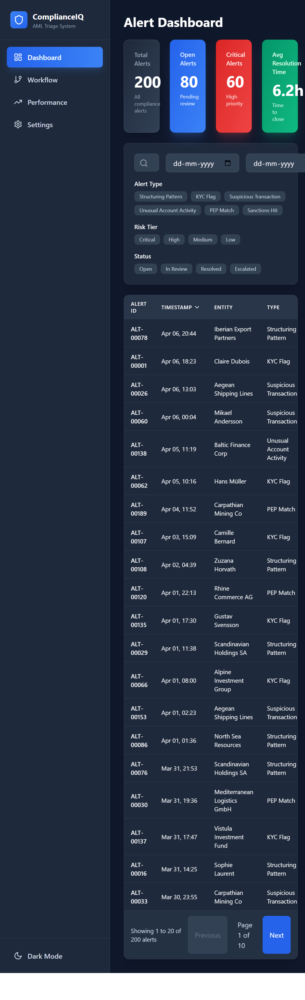
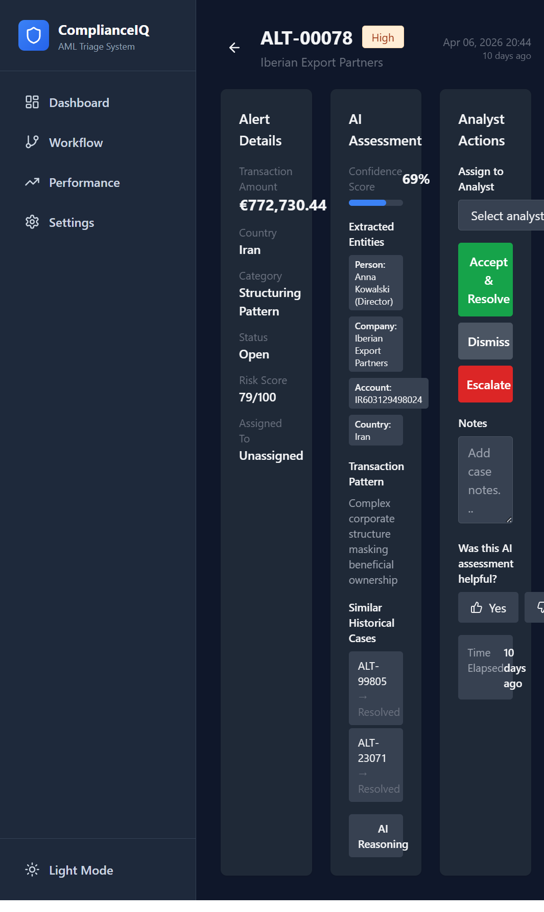
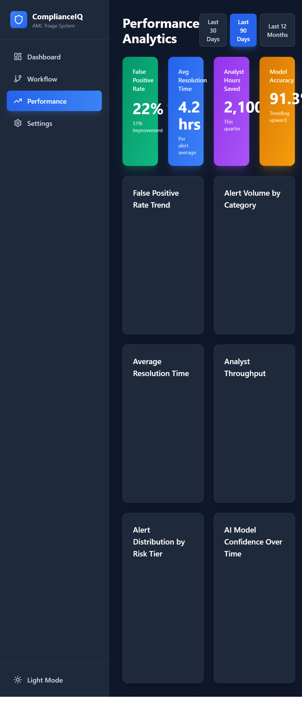

# 🏦 Compliance Alert Triage System

> AI-powered AML alert prioritization dashboard that reduces analyst review time by 40%
> while maintaining 99%+ detection accuracy for suspicious activities.

**[→ Live Demo](https://complianceiq-aml-triage.vercel.app)** · **[→ Case Study](casestudy/ComplianceIQ_Case_Study_Mehreen.docx)**

---

## The Problem

Compliance analysts at global banks are drowning in false positive alerts — industry
average is 95%+ false positive rate. At UBS, I saw firsthand how analysts spent
2,000+ hours annually investigating alerts that turned out to be nothing. The cost
isn't just time — it's alert fatigue that causes real suspicious activity to slip
through.

## My Approach

Built an AI-powered triage system that:
1. **Risk-scores every alert** using NLP extraction of transaction patterns,
   entity relationships, and historical case similarity
2. **Generates case summaries** so analysts start with context, not raw data
3. **Creates a feedback loop** where analyst actions improve the model over time
4. **Maintains human oversight** — high-risk alerts always require human review

## Key Product Decisions

- **Why NLP over rules-based?** Rules miss novel patterns. NLP catches semantic
  similarities across transaction narratives that rule engines can't.
- **Why human-in-the-loop for high-risk?** In compliance, a missed true positive
  is orders of magnitude worse than a false positive. The AI assists, it doesn't
  replace.
- **Why feedback loops?** Static models degrade. Analyst actions (accept/dismiss/
  escalate) are training signals that keep the model calibrated.

## Screenshots

| Dashboard | AI Triage Panel | Performance Metrics |
|-----------|----------------|-------------------|
|  |  |  |

## Metrics Framework

- **Primary:** False positive reduction rate (target: 45%+ reduction)
- **Secondary:** Analyst throughput (cases/hour), time-to-resolution, detection
  accuracy (true positive rate)
- **Guardrails:** Zero increase in missed suspicious activities, regulatory
  compliance score maintained

## Tech Stack

Built on Bolt.new · Mock data: 200+ synthetic compliance alerts · Charts: Recharts

## What I'd Do Differently

- Add multi-language support for cross-border transaction analysis
- Build explainability layer showing feature importance for each risk score
- Integrate with actual Actimize API for real alert ingestion

---
